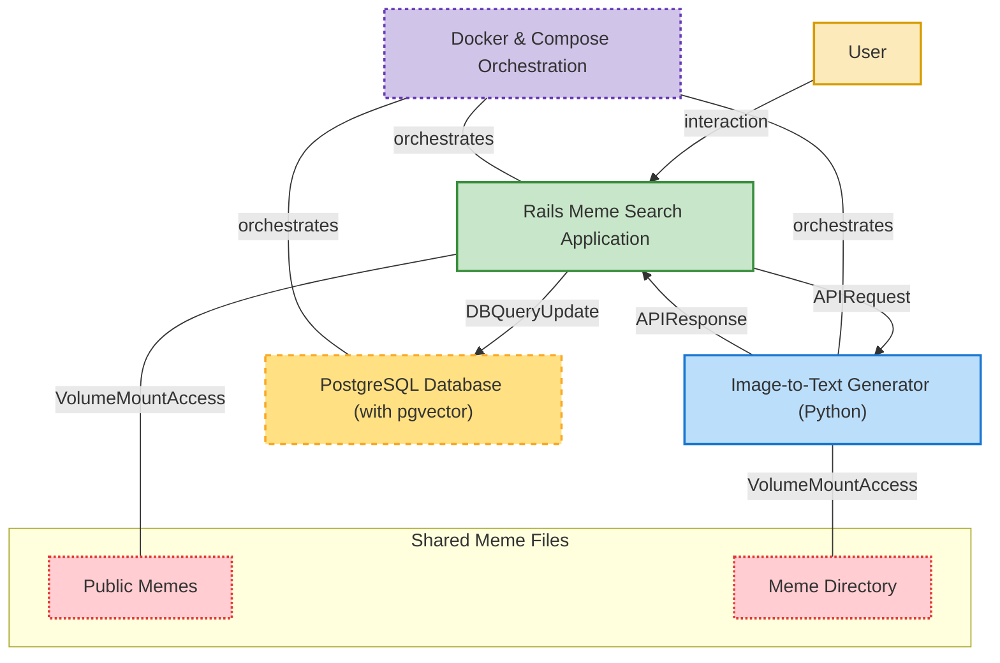

# A Meme Search Engine built to self-host in Python, Ruby, and Docker

Use AI to index your memes by their content and text, making them easily retrievable for your meme warfare pleasures.

All processing - from image-to-text extraction, to vector embedding, to search - is performed locally.

<p align="center">

</p>

This repository contains code, a walkthrough notebook, and apps for indexing, searching, and easily retrieving your memes based on semantic search of their content and text.

A table of contents for the remainder of this README:

- [Meme search](#meme-search)

  - [Features](#features)
  - [Installation instructions](#installation-instructions)
  - [Time to first generation / downloading models](#time-to-first-generation--downloading-models)
  - [Index your memes](#index-your-memes)
  - [Custom app port](#custom-app-port)
  - [Building the app locally with Docker](#building-the-app-locally-with-docker)
  - [Running tests](#running-tests)

- [Changelog](#changelog)
- [Feature requests and contributing](#feature-requests-and-contributing)


## Meme search

### Features

<p align="center">
  <div style="display: grid; grid-template-columns: repeat(2, 1fr); gap: 10px;">
    <figure>
      
      <figcaption>Search</figcaption>
    </figure>
    <figure>
      
      <figcaption>Edit</figcaption>
    </figure>
    <figure>
      
      <figcaption>Filter</figcaption>
    </figure>
    <figure>
      
      <figcaption>Generate</figcaption>
    </figure>
  </div>
</p>

Features of Meme Search include:

1. **Multiple Image-to-Text Models**

   Choose the right size image to text model for your needs / resources - from small (~200 Million parameters) to large (~2 Billion parameters).

   Current available image-to-text models for Meme Search include the following, starting with the default model:

   - [Florence-2-base](https://huggingface.co/microsoft/Florence-2-base) - a popular series of small vision language models built by Microsoft, including a 250 Million (base) and a 700 Million (large) parameter variant. \*This is the default model used in Meme Search\*.
   - [Florence-2-large](https://huggingface.co/microsoft/Florence-2-large) - the 700 Million parameter vision language model variant of the Florence-2 series
   - [SmolVLM-256](https://huggingface.co/collections/HuggingFaceTB/smolvlm-256m-and-500m-6791fafc5bb0ab8acc960fb0) - a 256 Million parameter vision language model built by Hugging Face
   - [SmolVLM-500](https://huggingface.co/collections/HuggingFaceTB/smolvlm-256m-and-500m-6791fafc5bb0ab8acc960fb0) - a 500 Million parameter vision language model built by Hugging Face
   - [Moondream2](https://huggingface.co/vikhyatk/moondream2) - a 2 Billion parameter vision language model used for image captioning / extracting image text

2. **Auto-Generate Meme Descriptions**

   Target specific memes for auto-description generation (instead of applying to your entire directory).

3. **Manual Meme Description Editing**

   Edit or add descriptions manually for better search results, no need to wait for auto-generation if you don't want to.

4. **Tags**

   Create, edit, and assign tags to memes for better organization and search filtering.

5. **Fast Vector Search**

   Powered by Postgres and pgvector, enjoy faster keyword and vector searches with streamlined database transactions.

6. **Directory Paths**

   Organize your memes across multiple subdirectories—no need to store everything in one folder.

7. **New Organizational Tools**

   Filter by tags, directory paths, and description embeddings, plus toggle between keyword and vector search for more control.

### Installation instructions

To start up the app pull this repository and start the server cluster with docker-compose

```sh
docker compose up
```

This pulls and starts containers for the app, database, and auto description generator. The app itself will run on port `3000` and is available at

```sh
http://localhost:3000
```

To start the app alone pull the repo and cd into the `meme_search/meme_search_pro/meme_search_app`. Once there execute the following to start the app in development mode

```sh
./bin/dev
```

When doing this ensure you have an available Postgres instance running locally on port `5432`.

**Note Linux users:** you may need to add the following `extra_hosts` to your `meme_search_pro` service for inter-container communication

```sh
extra_hosts:
    - "host.docker.internal:host-gateway"
```

### Time to first generation / downloading models

The first auto generation of description of a meme takes longer than average, as image-to-text model weights are downloaded and cached. Subsequent generations are faster.

You can download additional models in the settings tab of the app.

### Index your memes

You can index your memes by creating your own descriptions, or by generating descriptions automatically, as illustrated below.


To start indexing your own memes, first adjust the [compose file](https://github.com/neonwatty/meme-search/blob/main/docker-compose.yml) by adding `volume` mount to the `meme_search_pro` and `image_to_text_generator` services to properly connect your local meme subdirectory to the app.

For example, if suppose (one of your) meme directories was called `new_memes` and was located at the following path on your machine: `/local/path/to/my/memes/new_memes`.

To properly mount this subdirectory to the `meme_search_pro` service adjust the `volumes` portion of its configuration to the following:

```yaml
volumes:
  - ./meme_search_pro/memes/:/app/public/memes # <-- example meme directory from the repository
  -  /route/to/my/personal/additional_memes/:/rails/public/memes/additional_memes # <-- personal meme collection - must be placed inside /rails/public/memes in the container
```

Note: your `additional_memes` directory must be mounted internally in the `/rails/public/memes` directory, as shown above.

To properly mount this same subdirectory to the `image_to_text_generator` service adjust the `volumes` portion of its configuration to the following:

```yaml
volumes:
  - ./meme_search_pro/memes/:/app/public/memes # <-- example meme directory from the repository
  -  /route/to/my/personal/additional_memes/:/app/public/memes/additional_memes # <-- personal meme collection - must be placed inside /app/public/memes in the container
...
```

Note: your `additional_memes` directory must be mounted internally in the `/app/public/memes` directory, as shown above.

Now restart the app, and register the `additional_memes` via the UX by traversing to the `settings -> paths -> create new` as illustrated below.  Type in `additional_memes` in the field provided and press `enter`.


Once registered in the app, your memes are ready for indexing / tagging / etc.,!

### Model downloads

The image-to-text models used to auto generate descriptions for your memes are all open source, and vary in size.

### Custom app port

Easily customize the app's port to more easily use the it with tools like [Unraid](https://unraid.net/?srsltid=AfmBOorvWvSZbCHKnqdR__AcllotnsLR6did_FhAaNfUowqqU2IprD1v) or [Portainer](https://www.portainer.io/), or because you already have services running on the default `meme_search_pro` app port `3000`.

To customize the main app port create a `.env` file locally in the root of the directory. In this file you can define the following custom environment variables which define how the app, image to text generator, and database are accessed. These values are:

```sh
APP_PORT= # the port for the app - defaults to 3000
```

This value is automatically detected and loaded into each service via the `docker-compose-pro.yml` file.

### Building the app locally with Docker

To build the app - including all services defined in the `docker-compose.yml` file - locally run the local compose file at your terminal as

```sh
docker compose -f docker-compose-local-build.yml up --build
```

This will build the docker images for the app, database, and auto description generator, and start the app at `http://localhost:3000`.

### Running tests

To run tests locally pull the repo and cd into the `meme_search/meme_search_pro/meme_search_app` directory. Install the requird gems as

```sh
bundle install
```

Tests can then be run as

```sh
bash run_tests.sh
```

When doing this ensure you have an available Postgres instance running locally on port `5432`.

Run linting tests on the `/app` subdirectory as

```sh
rubocop app
```

to ensure the code is clean and well formatted.

## Changelog

Meme Search is under active development! See the `CHANGELOG.md` in this repo for a record of the most recent changes.

## Feature requests and contributing

Feature requests and contributions are welcome!

See [the discussion section of this repository](https://github.com/neonwatty/meme_search/discussions) for suggested enhancements to contribute to / weight in on!

Please see `CONTRIBUTING.md` for some boilerplate ground rules for contributing.

Below is a nice diagram of the repo [generated using gitdiagram](https://github.com/ahmedkhaleel2004/gitdiagram), laying out its main components and interactions.


